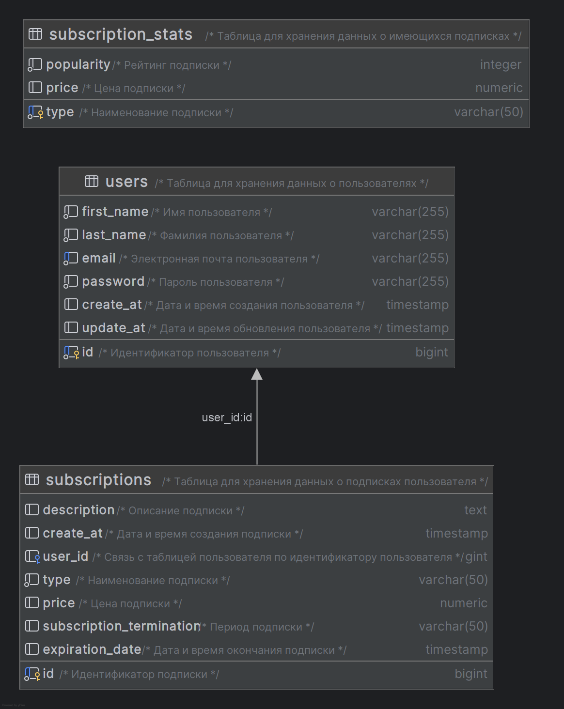

# Демо проект - Система управления пользователями

# Полноценное веб-приложение REST написано с использованием следующих технологий:

- Maven
- Hibernate
- JPA
- PostgresSQL
- Spring Boot
- Spring security
- Docker container
- Liquibase migration db

### Краткое описание проекта

- Автономное приложение, предоставляющее REST API

### Предварительные условия:

- Java 17
- PostgresSQL

# Запуск приложения с помощью Docker

Эта инструкция поможет вам запустить приложение в контейнере Docker.

## Предварительные требования

1. **Docker**: Убедитесь, что Docker установлен на вашем компьютере. Вы можете скачать и установить его
   с [официального сайта Docker](https://www.docker.com/get-started).

## Запуск приложения

Чтобы запустить приложение с помощью docker-compose, необходимо клонировать проект к себе на компьютер, после чего
создать в корне проекта файл `.env`, заполнить необходимые поля `**************`

```.dotenv
SERVER_PORT=8080

POSTGRES_DB=**************
POSTGRES_USER=**************
POSTGRES_PASSWORD=**************

POSTGRES_DB_URL=jdbc:postgresql://db/${POSTGRES_DB}
POSTGRES_DB_USERNAME=${POSTGRES_USER}
POSTGRES_DB_PASSWORD=${POSTGRES_PASSWORD}
```

## Шаги для запуска приложения

### 1. Запуск приложения с помощью Docker Compose

После вышеуказанных действий прописанных в инструкции, в директории, где находятся файлы прописать команду:

```bash
docker compose up
```

### После запуска приложения, можно запустить ```Swagger```

[](http://localhost:8080/swagger-ui/index.html)

### Мои запросы к приложению в Postman

[](https://documenter.getpostman.com/view/21948648/2sB2j7d9t6)

# Модель данных

## Диаграмма ER для модели данных

<a href="materials/database_schema.png">
    
</a>

## RESTful API

**1. Описание API общих методов для управления пользователями**

| METHOD | PATH               | DESCRIPTION                        |
|--------|--------------------|------------------------------------|
| POST   | /api/v1/users      | создать пользователя               |
| GET    | /api/v1/users/{id} | получить информацию о пользователе |
| PUT    | /api/v1/users/{id} | обновить пользователя              |
| DELETE | /api/v1/users/{id} | удалить пользователя               |

**2. Описание API общих методов для управления подписками**

| METHOD | PATH                                      | DESCRIPTION                        |
|--------|-------------------------------------------|------------------------------------|
| POST   | /api/v1/subscriptions/users/{id}          | добавить подписку                  |
| GET    | /api/v1/subscriptions/users/{id}          | получить подписку пользователя     |
| DELETE | /api/v1/subscriptions/{sub_id}/users/{id} | удалить подписку                   |
| GET    | /api/v1/subscriptions/top                 | получить ТОП-3 популярных подписок |